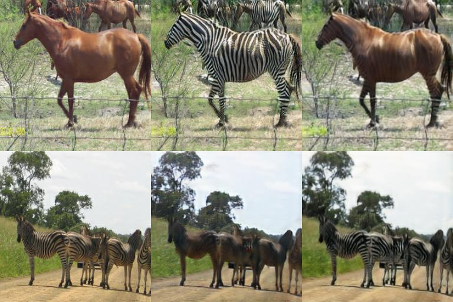
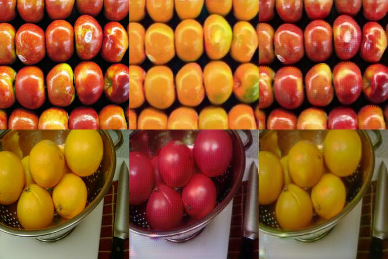

***Recommendation***

- Our GAN based work for facial attribute editing - https://github.com/LynnHo/AttGAN-Tensorflow.

---

***New***

 - 2018.04.13: We modify the codes: use the newest tensorflow 1.7 API, and remove the redundancies.

 - 2017.12.22: We add a simple PyTorch implementation, see the "pytorch" folder.

# CycleGAN
Tensorflow implementation of CycleGAN.

Paper: [Unpaired Image-to-Image Translation using Cycle-Consistent Adversarial Networks](https://arxiv.org/pdf/1703.10593.pdf)
Author: [Jun-Yan Zhu ](https://people.eecs.berkeley.edu/~junyanz/) *et al.*

## Exemplar results on testset
- gif: horse -> zebra

- row 1: horse -> zebra -> reconstructed horse, row 2: zebra -> horse -> reconstructed zebra

- row 1: apple -> orange -> reconstructed apple, row 2: orange -> apple -> reconstructed orange


# Prerequisites
- tensorflow r1.7
- python 2.7

# Usage
```
cd CycleGAN-Tensorflow-PyTorch-master
```

## Download Datasets
- Download the horse2zebra dataset:
```bash
sh ./download_dataset.sh horse2zebra
```
- Download the apple2orange dataset:
```bash
sh ./download_dataset.sh apple2orange
```
- See download_dataset.sh for more datasets

## Train Example
```bash
CUDA_VISIBLE_DEVICES=0 python train.py --dataset=horse2zebra
```

## Test Example
```bash
CUDA_VISIBLE_DEVICES=0 python test.py --dataset=horse2zebra
```
