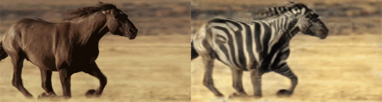
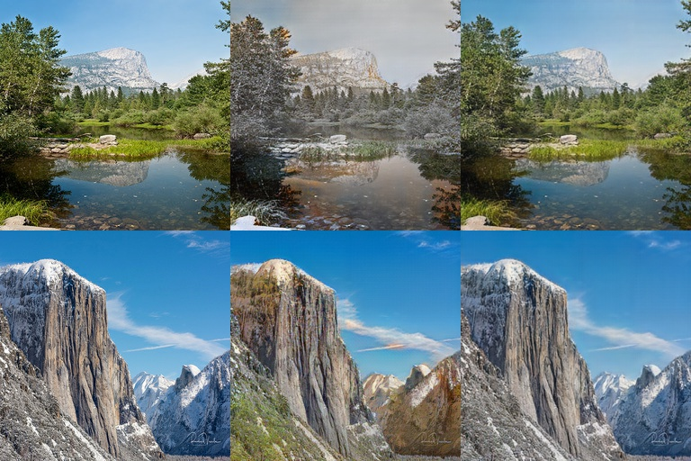
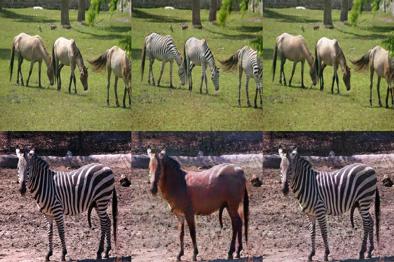

***Recommendation***

- Our GAN based work for facial attribute editing - [AttGAN](https://github.com/LynnHo/AttGAN-Tensorflow).

***New***

- We re-implement CycleGAN by **Tensorflow 2**! The old versions are here: [v1](https://github.com/LynnHo/CycleGAN-Tensorflow-PyTorch/tree/v1), [v0](https://github.com/LynnHo/CycleGAN-Tensorflow-PyTorch/tree/v0).

<hr style="height:1px" />

<p align="center">  </p>

<hr style="height:1px" />

# <p align="center"> CycleGAN - Tensorflow 2 </p>

Tensorflow 2 implementation of CycleGAN.

Paper: [Unpaired Image-to-Image Translation using Cycle-Consistent Adversarial Networks](https://arxiv.org/pdf/1703.10593.pdf)

Author: [Jun-Yan Zhu ](https://people.eecs.berkeley.edu/~junyanz/) *et al.*

## Exemplar results

### summer2winter

row 1: summer -> winter -> reconstructed summer, row 2: winter -> summer -> reconstructed winter

<p align="center">  </p>

### horse2zebra

row 1: horse -> zebra -> reconstructed horse, row 2: zebra -> horse -> reconstructed zebra

<p align="center">  </p>

### apple2orange

row 1: apple -> orange -> reconstructed apple, row 2: orange -> apple -> reconstructed orange

<p align="center">  </p>

# Usage

- Prerequisites

    - Tensorflow 2.0 `pip install tensorflow-gpu`
    - Tensorflow Addons `pip install tensorflow-addons`
    - (if you meet "tf.summary.histogram fails with TypeError" `pip install --upgrade tb-nightly`)
    - scikit-image, oyaml, tqdm
    - Python 3.6

- Dataset

    - download the summer2winter dataset

        ```console
        sh ./download_dataset.sh summer2winter_yosemite
        ```

    - download the horse2zebra dataset

        ```console
        sh ./download_dataset.sh horse2zebra
        ```

    - see [download_dataset.sh](./download_dataset.sh) for more datasets

- Example of training

    ```console
    CUDA_VISIBLE_DEVICES=0 python train.py --dataset summer2winter_yosemite
    ```

    - tensorboard for loss visualization

        ```console
        tensorboard --logdir ./output/summer2winter_yosemite/summaries --port 6006
        ```

- Example of testing

    ```console
    CUDA_VISIBLE_DEVICES=0 python test.py --experiment_dir ./output/summer2winter_yosemite
    ```
